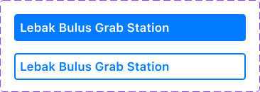
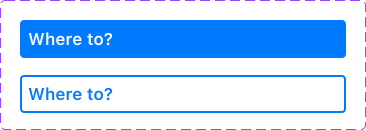
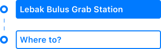
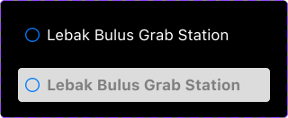
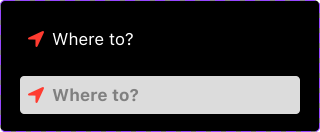

# Contents

1. [Component Oriented Design](#component-oriented-design)
2. [Protocol Orineted Programming](#protocol-oriented-programming)
3. [Use Case Oriented Programming](#use-case-oriented-programming)
4. [Clean Architecture](#clean-architecture-programming)
5. [Shenanigans](#shenanigans)
6. [To Do](#to-do)

# Design

[LoFi, HiFi, Prototype in Figma](https://www.figma.com/file/YYsNa16jRdHbOHHMoPREeP/MRT-Jakarta-Navigation?type=design&node-id=0%3A1&mode=design&t=mVYUCc8HBF6CJfJz-1)

# Goal

For UI/UX Designer:
1. Do component variant iteration and not screen iteration. Make sure LoFi is well defined.
2. Consider every variants of a component.
3. Use tokenized color and not primitive color or hex color.
4. Consider how user navigate from screen A to screen B.

For Software Engineer:
1. Consider how others use your code. Every function should have actionable result.
2. 1 file per component and not 1 file per screen. 1 file should only do/provide a specific thing.
3. 1 file per component if the component use the domain layer.
4. Guarantee your work to be bug free. Others expect your code to work in order for their code to work properly.
5. Follow the SOLID principle. Make sure dependency can be injected from outside / constructor i.e. from `init`.
6. Violate the DRY principle if necessary.

# Component Oriented Design

Component Oriented Design enables you to focus on 1 specific user activity (what user can do, what user can see) and the component iteration.

Example of a component:
1. Component to select departure and arrival station.
2. Component to give info about the next train schedule and estimated of time arrival to the destination.

<details>
<summary>For example, a project have 4 user stories.</summary>

**User Stories**
* User gets vibration and/or sound notification when arrive at their destination.
* User gets vibration and/or sound notification when the user near any station when in initial mode (Have not started navigation) and app in background mode.
* User gets vibration and/or sound notification when a train arrive in the departure station when in commuting mode (Have started navigation).
* User gets vibration and/or sound notification when the user arrive in a transit station when in commuting mode.
</details>

**Workflow**

1. Project Manager do vertical development by slicing the 1st user story into 3 use cases.

    <details>
    <summary>For example, 1 user story into 3 use cases</summary>

    * User Story: User gets vibration and/or sound notification when arrive at their destination.

    * Use Cases:
        * User able to start navigation by selecting departure station and destination (High priority).
        * Notify user when arrived in destination when app in background mode (High priority).
        * Notify user when arrived in destination when app in foreground mode (High priority).
     
    </summary>

2. UI/UX Designer creates the LoFi by defining `what user can do` and `what user can see` in a specific Page.

    **LoFi Principles:**
    * Only use the Shape and the Text tools in Figma.
    * Use button hierarchy (primary, secondary, tertiary).
    * No local variables, no local styles, no components.
  
    <details>
    <summary>For example, what user can see and what user can do</summary>

    What user can see: Departure station and destination.

    What user can do: Change the departure station and destination by clicking the buttton.
    </details>

3. UI/UX Designer creates the design style guide.

    **Design style guide principles:**
    * Shape and text tools always use the tokenized colors.  

        Do not use the primitive colors directly.

        <details>
        <summary>For example, Primitives Color</summary>

        * red
            * red/0 = #FF000000
            * red/10 = #8B0000
            * red/20 = #800000

        * blue
            * blue/0 = #0000FF
            * blue/10 = #0000CD
            * blue/20 = #00008B

        * green
            * green/0 = #008000
            * green/10 = #006400
            * green/20 = #ADFF2F

        * white
            * white/0 = #FFFFFF
            * black/0 = #000000
        </details>

    * Tokenized colors uses the primitive colors. 

        Do not use the color hex directly. 

        Tokenized colors have Light and Dark Mode.

        <details>
        <summary>For example, Tokenized Color</summary>

        * clickableButtonBackground
            * Any = blue/0
            * Dark = blue/0

        * clickableButtonText
            * Any = white/0
            * Dark = white/0

        * focusedButtonText
            * Any = blue/0
            * Dark = blue/0

        * focusedButtonStroke
            * Any = black/0
            * Dark = black/0
        </details>

    * It is advisable to use [Apple's Typography](https://developer.apple.com/design/human-interface-guidelines/typography) and [Apple's Color](https://developer.apple.com/design/human-interface-guidelines/color).

    <details>
    <summary>Why use tokenized color?</summary>

    * Imagine you prefer to use `Hex color` directly.

        Imagine you have 3 identical shapes used in 3 Screens that use Hex color directly. 

        Now, imagine you want to change the shape's color. 

        You will have to change each Shape in each Screen, 3 times.

        Important: If you use Component in Figma, you only need to change the shape's color 1 time.

    * Imagine you prefer to use `Primitive color to Hex color` directly.

        Imagine you have primary button and the screen support Light Mode and Dark Mode.
        
        Consequently, you have 2 components for primary button: i.e.
        * Primary button background which use White color in Light Mode.
        * Primary button background which use Black color in Dark Mode.

        Now, imagine you want to change the primary button's background color. You will have to change the primary button's background color in each component, 2 times.

        Now, imagine if you use Tokenized color, `primary_button_background`. Now, you only need to change the Tokenized color. Also, you will only have 1 primary button component.

    * Imagine you prefer to use `Tokenized color to Hex color` directly and not to Primitive color.

        Imagine you have a 3 tokenized colors with Hex color #000000. #000000 is black in terms of primitive color.

        Now, imagine you want to change every #000000 to slightly brighter black Hex color #000011. 

        You will have to change each tokenized color, 3 times.
      </details>

4. Software Engineer register the tokenized colors.

   <details>
      <summary>Tokenized colors</summary>
      
    * clickableButtonBackground
        * Any = #0000FF
        * Dark = #0000FF

    * clickableButtonText
        * Any = #FFFFFF
        * Dark = #FFFFFF

    * focusedButtonText
        * Any = #0000FF
        * Dark = #0000FF

    * focusedButtonStroke
        * Any = #000000
        * Dark = #000000
    </details>

5. UI/UX Designer creates the HiFi component for the departure and arrival button using components.

    <details>
    <summary>For example, departure & arrival components</summary>

    Departure's component Iteration 1

    

    Arrival's component Iteration 1

    
    
    DepartureArrival's component Iteration 1
    
    
    </details>

6. Software Engineer creates the component's code.

    **Component's coding style guide:**

    * Use `@Binding` / `@ObservedObject`

        <details>
        <summary>DepartureArrivalV1View.swift</summary>
           
        ```swift
        struct DepartureArrivalV1View<SelectVM: DepartureArrivalViewModel>: View {
            @ObservedObject var selectVM: SelectVM
            @Binding var selectedDetent: PresentationDetent
            
            init(
                selectVM: SelectVM = DepartureArrivalV1ViewModel(),
                selectedDetent: Binding<PresentationDetent> = .constant(.header)
            ) {
                self.selectVM = selectVM
                self._selectedDetent = selectedDetent
            }
            
            var body: some View {
                Grid(horizontalSpacing: 0, verticalSpacing: 0) {
                    GridRow {
                        Circle()
                            .stroke(.blue, lineWidth: 4)
                            .frame(width: 16, height: 16)
                            .padding(.trailing, 16)
                        
                        DepartureOrArrivalButtonView(value: $selectVM.departure, selected: $selectVM.departureSelected, selectedDetent: $selectedDetent)
                    }
                    
                    GridRow {
                        Line()
                            .stroke(style: StrokeStyle(lineWidth: 2, dash: [8,8]))
                            .foregroundColor(Color("departureArrival_line"))
                            .frame(width: 1, height: 24)
                            .padding(.trailing, 16)
                        
                        
                    }
                    
                    GridRow {
                        Circle()
                            .stroke(.blue, lineWidth: 4)
                            .frame(width: 16, height: 16)
                            .padding(.trailing, 16)
                        
                        DepartureOrArrivalButtonView(value: $selectVM.arrival, selected: $selectVM.arrivalSelected, selectedDetent: $selectedDetent)
                    }
                }
            }
        }
        ```
        </details>

        <details>
        <summary>DepartureArrivalV1View+DepartureArrivalButtonView.swift</summary>
           
        ```swift
        extension DepartureArrivalV1View {
            struct DepartureOrArrivalButtonView: View {
                @Binding var value: Station?
                @Binding var selected: Bool
                @Binding var selectedDetent: PresentationDetent
                
                init(
                    value: Binding<Station?> = .constant(nil),
                    selected: Binding<Bool> = .constant(true),
                    selectedDetent: Binding<PresentationDetent> = .constant(.header)
                ) {
                    self._value = value
                    self._selected = selected
                    self._selectedDetent = selectedDetent
                }
                
                var body: some View {
                    Button {
                        withAnimation {
                            selected = true
                            selectedDetent = .large
                        }
                    } label: {
                        Text((value != nil) ? "\(value?.name ?? "") Station" : "Where to?")
                            .frame(maxWidth: .infinity, alignment: .leading)
                            .font(.headline)
                    }
                    .buttonStyle(selected ? Either.left(.bordered) : .right(.borderedProminent))
                }
            }
        }
        ```
        </details>

    * The purpose of a preview is to show how to use the component in a screen.

        <details>
        <summary>The example to show how to use the component</summary>
           
        ```swift
        #if DEBUG
        private struct DepartureArrivalViewExample<SelectVM: DepartureArrivalViewModel>: View {
            @StateObject private var selectVM: SelectVM
            
            init(selectVM: SelectVM = DepartureArrivalV1ViewModel()) {
                self._selectVM = StateObject(wrappedValue: selectVM)
            }
            
            var body: some View {
                VStack(spacing: 32) {
                    DepartureArrivalV1View(selectVM: selectVM)
                    
                    VStack(spacing: 20) {
                        Button {
                            withAnimation {
                                _ = selectVM.updateDepartureArrival(value: MRT.LebakBulusGrab.station)
                            }
                        } label: {
                            Text("\(MRT.LebakBulusGrab.station.name) Station")
                                .frame(maxWidth: .infinity, alignment: .leading)
                        }
                        .font(.headline)
                        .buttonStyle(.borderedProminent)
                        
                        Button {
                            withAnimation {
                                _ = selectVM.updateDepartureArrival(value: MRT.FatmawatiIndomaret.station)
                            }
                        } label: {
                            Text("\(MRT.FatmawatiIndomaret.station.name) Station")
                                .frame(maxWidth: .infinity, alignment: .leading)
                        }
                        .font(.headline)
                        .buttonStyle(.borderedProminent)
                        
                        Button {
                            withAnimation {
                                _ = selectVM.updateDepartureArrival(value: MRT.CipeteRaya.station)
                            }
                        } label: {
                            Text("\(MRT.CipeteRaya.station.name) Station")
                                .frame(maxWidth: .infinity, alignment: .leading)
                        }
                        .font(.headline)
                        .buttonStyle(.borderedProminent)
                    }
                    
                    Spacer()
                }
                .padding(.top, 32)
                .padding(.horizontal, 32)
            }
        }

        struct DepartureArrivalViewExample_Previews: PreviewProvider {
            static var previews: some View {
                DepartureArrivalViewExample()
                    .environment(\.locale, .init(identifier: "id-ID"))
            }
        }
        #endif
        ```
        </details>

    * Use ViewModel if you have more than 1 variable to observe.

        Important: 1 ViewModel per responsibility.

        <details>
        <summary>For example, a View used 2 ViewModels</summary>

        * a ViewModel to handle the departure, arrival variables.
        * a ViewModel to handle the nearest schedule at departure and estimated time arrival at destination variables.
        </details>
    
    * In a ViewModel, use guard clause to handle unique use case. 
    
        Important: Add the explanation on top of that guard clause pattern.

        <details>
        <summary>For example, a unique use case</summary>
        
        ```
        arrival value: Lebak Bulus Grab Station
        use case: user want to go from Lebak Bulus Grab Station
        ```
        
        DepartureArrivalViewModelImpl.swift
        ```swift
        class DepartureArrivalViewModelImpl: DepartureArrivalViewModel {
            @Published var departure: Station?
            @Published var arrival: Station?
            
            @Published var departureSelected: Bool
            var arrivalSelected: Bool {
                get {
                    return !departureSelected
                }
                set {
                    departureSelected = !newValue
                }
            }
            
            var currentSelected: Binding<Station?> {
                get {
                    return Binding<Station?>(
                        get: {
                            if self.departureSelected {
                                return self.departure
                            } else {
                                return self.arrival
                            }
                        },
                        set: { newValue in
                            guard let newValue else { return }
                            
                            _ = self.updateDepartureArrival(value: newValue)
                        }
                    )
                }
            }
            
            init(departure: Station? = MRT.LebakBulusGrab.station, arrival: Station? = nil, departureSelected: Bool = false) {
                self.departure = departure
                self.arrival = arrival
                self.departureSelected = departureSelected
        #if DEBUG
                print("\(type(of: self)) \(#function)")
        #endif
            }
            
            deinit {
        #if DEBUG
                print("\(type(of: self)) \(#function)")
        #endif
            }
            
            func updateDepartureArrival(value: Station) -> Bool {
                switch departureSelected {
                case true:
                    // arrival value: Lebak Bulus Grab Station
                    // use case: user want to go from Lebak Bulus Grab Station
                    if arrival == value {
                        departure = value
                        arrival = nil
                        return true
                    }
                    
                    departure = value
                case false:
                    // departure value: Lebak Bulus Grab Station
                    // use case: user want to go from Dukuh Atas BNI Station to Lebak Bulus Grab
                    if departure == value {
                        departure = nil
                        arrival = value
                        return true
                    }
                    
                    arrival = value
                }
                
                return true
            }
            
            func isDepartureArrivalNotNil() -> Bool {
                if departure == nil { return false }
                if arrival == nil { return false }
                
                return true
            }
        }
        ```
        </details>

7. UI/UX Designer creates component's iteration.

    <details>
    <summary>For example, departure and arrival components' iterations</summary>
       
    Departure Iteration 1

    

    Departure Iteration 2

    

    Arrival Iteration 1

    

    Arrival Iteration 2

    
    </details>

9. Software Engineer creates component's iteration.

    **Component's iteration principles:**
    * If 1st iteration and 2nd iteration have different behavior. i.e.
        * 1st iteration auto swap between departure and arrival station.
        * 2nd iteration do not auto swap between departure and arrival station.
    
        Then, use protocol oriented programming.

        <details>
        <summary>DepartureArrivalViewModel.swift</summary>
           
        ```swift
        protocol DepartureArrivalViewModel: ObservableObject {
            var departure: Station? { get set }
            var arrival: Station? { get set }
            var departureSelected: Bool { get set }
            var arrivalSelected: Bool { get set }
            
            func updateDepartureArrival(value: Station) -> Bool
            func isDepartureArrivalNotNil() -> Bool
        }
        ```
        </details>

        <details>
        <summary>DepartureArrivalViewModelImpl.swift</summary>
           
        ```swift
        class DepartureArrivalViewModelImpl: DepartureArrivalViewModel {
            @Published var departure: Station?
            @Published var arrival: Station?
            
            @Published var departureSelected: Bool
            var arrivalSelected: Bool {
                get {
                    return !departureSelected
                }
                set {
                    departureSelected = !newValue
                }
            }
            
            init(departure: Station? = MRT.LebakBulusGrab.station, arrival: Station? = nil, departureSelected: Bool = false) {
                self.departure = departure
                self.arrival = arrival
                self.departureSelected = departureSelected
            }
            
            func updateDepartureArrival(value: Station) -> Bool {
                switch departureSelected {
                case true:
                    // arrival value: Lebak Bulus Grab Station
                    // use case: user want to go from Lebak Bulus Grab Station
                    if arrival == value {
                        departure = value
                        arrival = nil
                        return true
                    }
                    
                    departure = value
                case false:
                    // departure value: Lebak Bulus Grab Station
                    // use case: user want to go from Dukuh Atas BNI Station to Lebak Bulus Grab
                    if departure == value {
                        departure = nil
                        arrival = value
                        return true
                    }
                    
                    arrival = value
                }
                
                return true
            }
            
            func isDepartureArrivalNotNil() -> Bool {
                if departure == nil { return false }
                if arrival == nil { return false }
                
                return true
            }
        }
        ```
        </details>

        <details>
        <summary>Iteration 1: DepartureArrivalV1ViewModel.swift & DepartureArrivalV1View.swift</summary>
           
        DepartureArrivalV1ViewModel.swift
        ```swift
        final class DepartureArrivalV1ViewModel: DepartureArrivalViewModelImpl {}
        ```
        
        DepartureArrivalV1View.swift
        ```swift
        struct DepartureArrivalV1View<ViewModel>: View where ViewModel: DepartureArrivalViewModel {
            @ObservedObject private var viewModel: ViewModel
            
            init(viewModel: ViewModel = DepartureArrivalV1ViewModel()) {
                self.viewModel = viewModel
            }
            
            var body: some View {
                Grid(horizontalSpacing: 0, verticalSpacing: 0) {
                    GridRow {
                        Circle()
                            .stroke(.blue, lineWidth: 4)
                            .frame(width: 16, height: 16)
                            .padding(.trailing, 16)
                        
                        DepartureOrArrivalButtonView(value: $viewModel.departure, selected: $viewModel.departureSelected)
                    }
                    
                    GridRow {
                        Line()
                            .stroke(style: StrokeStyle(lineWidth: 2, dash: [8,8]))
                            .foregroundColor(Color("departureArrival_line"))
                            .frame(width: 1, height: 24)
                            .padding(.trailing, 16)
                        
                        
                    }
                    
                    GridRow {
                        Circle()
                            .stroke(.blue, lineWidth: 4)
                            .frame(width: 16, height: 16)
                            .padding(.trailing, 16)
                        
                        DepartureOrArrivalButtonView(value: $viewModel.arrival, selected: $viewModel.arrivalSelected)
                    }
                }
            }
        }
        ```
        </details>

        <details>
        <summary>Iteration 2: DepartureArrivalV2ViewModel.swif and DepartureArrivalV2View.swift</summary>
      
        DepartureArrivalV2ViewModel.swif
        ```swift
        final class DepartureArrivalV2ViewModel: DepartureArrivalViewModelImpl {
            override func updateDepartureArrival(value: Station) -> Bool {
                switch departureSelected {
                case true:
                    departure = value
                case false:
                    arrival = value
                }
                
                return true
            }
        }
        ```
        
        DepartureArrivalV2View.swift
        ```swift
        struct DepartureArrivalV2View<SelectVM: DepartureArrivalViewModel>: View {
            @ObservedObject private var selectVM: SelectVM
            
            init(selectVM: SelectVM = DepartureArrivalV2ViewModel()) {
                self._selectVM = ObservedObject(wrappedValue: selectVM)
            }
            
            var body: some View {
                VStack(spacing: 0) {
                    HStack(spacing: 0) {
                        DepartureV2View(value: $selectVM.departure, selected: $selectVM.departureSelected)
                        Spacer()
                            .frame(width: 24, height: 24)
                            .padding(.leading, 16)
                    }
                    HStack(spacing: 0) {
                        ArrivalV2View(value: $selectVM.arrival, selected: $selectVM.arrivalSelected)
                        PlusCircleView()
                            .padding(.leading, 16)
                    }
                }
            }
        }
        ```
        </details>

# Protocol Oriented Programming

Protocol Oriented Programming enables you to integrate others' work without actually need to wait (for the work to be finished) or to know how it works, i.e.:
* Engineer A creates `protocol NotifyWhenNearMRTStationWithGPS` with 2 methods.
    * `func start()` to start the notifier.
    * `func stop()` to stop the notifier.
    * `var delegate: NotifyWhenNearMRTStationWithGPSDelegate?` which will be called everytime the notifier detect nearby MRT station.
* Engineer B build the View that call func `start()`, `stop()` and create a ViewModel that conform to `protocol NotifyWhenNearMRTStationWithGPSDelegate`.

Notice that Engineer B do not need to wait for Engineer A to finish his work.

Important: Engineer A and B have to agree on the protocol (the expected result) before starting to code.

<details>
<summary>For example, based on the 1st user story:</summary>

Engineer creates protocol for every use cases of the 1st user story.

* NotifyWhenNearMRTStationAndSpecificMRTStationOnce, requires:
    * NotifyWhenNearMRTStationWithGPS
    * NotifyWhenNearMRTstationWithBluetooth
    * AlarmManager (able to vibrate and/or play audio in background and foreground mode)

* NotifyWhenNearMRTStationOnce, requires:
    * NotifyWhenNearMRTStationWithGPS
    * NotifyWhenNearMRTStationWithBluetooth

* NotifyWhenNearMRTStationWhenInBackground, requires:
    * NotifyWhenNearMRTStationWithGPS
    * NotifyWhenNearMRTStationWithBluetooth
    * NotificationManager

* NotifyWhenNearMRTStationWithGPS, requires:
    * LocationFinder

* NotifyWhenMRTStationWithBluetooth, requires:
    * BeaconFinder

* BeaconBroadcaster (to simulate)
</details>


**Use Case protocol's coding style guide:**
* use delegate pattern if you wish to return a result asynchronously.

    

    <details>
    <summary>NotifyWhenNearMRTStationWithGPS.swift</summary>
    
    ```swift
    protocol NotifyWhenNearMRTStationWithGPS {
        var delegate: NotifyWhenNearMRTStationWithGPSDelegate? { get set }
        
        func start() -> NotifyWhenNearMRTStationWithGPSStartEvent
        func stop() -> NotifyWhenNearMRTStationWithGPSStopEvent
    }

    protocol NotifyWhenNearMRTStationWithGPSDelegate {
        /// will notify once per station.
        func notifyManager(_ manager: NotifyWhenNearMRTStationWithGPS, didFind: Station)
    }

    protocol NotifyWhenNearMRTStationWithGPSEvent {}

    enum NotifyWhenNearMRTStationWithGPSStartEvent: NotifyWhenNearMRTStationWithGPSEvent { case IS_STARTING, NOT_AUTHORIZED }

    enum NotifyWhenNearMRTStationWithGPSStopEvent: NotifyWhenNearMRTStationWithGPSEvent { case IS_STOPPING }
    ```
    </details>

* a function should return an actionable result i.e. `Bool` or `enum`.

* If function can't return a result, use completion pattern

    <details>
    <summary>Notification.swift</summary>
       
    ```swift
    protocol Notification {
        /// please show alert in view if return false
        func isAuthorizedOrRequestAuthorization(completionHandler: @escaping (Bool) -> Void)
        
        func push(title: String, subtitle: String, sound: UNNotificationSound?, completionHandler: @escaping (Bool) -> Void)
        func reset() -> NotificationResetEvent
    }

    protocol NotificationEvent {}

    enum NotificationPushEvent: NotificationEvent { case IS_PUSHING, NOT_AUTHORIZED }

    enum NotificationResetEvent: NotificationEvent { case IS_RESETTING }
    ```
    </details>

* a function should have documentation comments if have unique behavior. 

    <details>
    <summary>For example, the notifier will update once per station.</summary>
    
    NotifyWhenNearMRTStationWithBluetooth.swift
    ```swift
    protocol NotifyWhenNearMRTStationWithBluetooth {
        var delegate: NotifyWhenNearMRTStationWithBluetoothDelegate? { get set }
        
        func start() -> NotifyWhenNearMRTStationWithBluetoothStartEvent
        func stop() -> NotifyWhenNearMRTStationWithBluetoothStopEvent
    }

    protocol NotifyWhenNearMRTStationWithBluetoothDelegate {
        // will update once per station
        func notifyManager(_ manager: NotifyWhenNearMRTStationWithBluetooth, didFind: Station)
    }

    protocol NotifyWhenNearMRTStationWithBluetoothEvent {}

    enum NotifyWhenNearMRTStationWithBluetoothStartEvent: NotifyWhenNearMRTStationWithBluetoothEvent { case IS_STARTING, NOT_AUTHORIZED }

    enum NotifyWhenNearMRTStationWithBluetoothStopEvent: NotifyWhenNearMRTStationWhenInBackgroundEvent { case IS_STOPPING }
    ```
    </details>

* a function should use delegate pattern if have unique behavior.

    <details>
    <summary>For example, the notifier will stop when found specific MRT stationevent</summary>
    
    NotifyWhenNearMRTStationAndSpecificMRTStationOnce.swift
    ```swift
    protocol NotifyWhenNearMRTStationAndSpecificMRTStationOnce {
        var delegate: NotifyWhenNearMRTStationAndSpecificMRTStationOnceDelegate? { get set }
        
        /// will stop when found specific MRT station
        func start(arrival: Station) -> NotifyWhenNearMRTStationAndSpecificMRTStationOnceStartEvent
        /// for abrupt stop.
        func stop() -> NotifyWhenNearMRTStationAndSpecificMRTStationOnceStopEvent
    }

    enum NotifyWhenNearMRTStationAndSpecificMRTStationOnceDelegateEvent {
        case FOUND
        // will stop when arrived
        case ARRIVED
    }

    protocol NotifyWhenNearMRTStationAndSpecificMRTStationOnceDelegate {
        func notifyManager(_ manager: NotifyWhenNearMRTStationAndSpecificMRTStationOnce, didFind station: Station, didEvent event: NotifyWhenNearMRTStationAndSpecificMRTStationOnceDelegateEvent)
    }

    protocol NotifyWhenNearMRTStationAndSpecificMRTStationOnceEvent {}

    enum NotifyWhenNearMRTStationAndSpecificMRTStationOnceStartEvent: NotifyWhenNearMRTStationAndSpecificMRTStationOnceEvent { case IS_STARTING, NOT_AUTHORIZED }

    enum NotifyWhenNearMRTStationAndSpecificMRTStationOnceStopEvent: NotifyWhenNearMRTStationAndSpecificMRTStationOnceEvent { case IS_STOPPING }
    ```
    </details>

# Use Case Oriented Programming

Use Case Oriented Programming enables you to focus on 1 specific business logic.

<details>
<summary>For example, if Bluetooth is not available, use GPS use case.</summary>

Engineer A creates the business logic to notify when near MRT Station with GPS in `NotifyWhenNearMRTStationWithGPS.swift`.

Engineer B creates the business logic to notify when near MRT Station with Bluetooth in `NotifyWhenNearMRTStationWithBluetooth.swift`.

Then, you can write another use case to do `if Bluetooth is not available, use GPS` in `NotifyWhenNearMRTStationAndSpecificMRTStationOnce.swift`
</details>

**Protocol implementation's coding style guide:**
* `init` function should have default value.
* if `init` use static variable as default value, the implementation should have `deinit` closure.
* the static variable should live in a final class Manager. 

    By doing so, when you want to change the implementation logic, you can replace the shared variable's value.

    <details>
    <summary>NotificationManager.swift</summary>
       
    ```swift
    final class NotificationManager {
        static weak var shared: Notification! {
            get {
                var temp: Notification
                
                if sharedClosure == nil {
                    temp = NotificationImpl.shared
                    sharedClosure = temp
                }
                
                return sharedClosure
            }
        }
        
        private static weak var sharedClosure: Notification?
    }
    ```
    </details>

    since Notification should not have more than 2 instance, you should private the constructor.

    <details>
    <summary>NotificationImpl.swift</summary>
       
    ```swift
    final class NotificationImpl: Notification {
        fileprivate init() {
    #if DEBUG
            print("\(type(of: self)) \(#function)")
    #endif
        }
        
        deinit {
    #if DEBUG
            print("\(type(of: self)) \(#function)")
    #endif
        }
        
        func isAuthorizedOrRequestAuthorization(completionHandler: @escaping (Bool) -> Void) {}
        
        func push(title: String, subtitle: String, sound: UNNotificationSound? = nil, completionHandler: @escaping (Bool) -> Void) {
        }
        
        func reset() -> NotificationResetEvent {
            return .IS_RESETTING
        }
    }

    extension NotificationImpl {
        static weak var shared: Notification! {
            get {
                var temp: Notification
                
                if sharedClosure == nil {
                    temp = NotificationImpl()
                    sharedClosure = temp
                }
                
                return sharedClosure
            }
        }
        
        private static weak var sharedClosure: Notification?
    }
    ```
    </details>

    <details>
    <summary>NotifyWhenNearMRTStationAndSpecificMRTStationOnceImpl.swift</summary>
       
    ```swift
    final class NotifyWhenNearMRTStationAndSpecificMRTStationOnceImpl: NotifyWhenNearMRTStationAndSpecificMRTStationOnce {
        var delegate: NotifyWhenNearMRTStationAndSpecificMRTStationOnceDelegate?
        
        private var notifyWhenNearMRTStationWithBluetooth: NotifyWhenNearMRTStationWithBluetooth
        private var notifyWhenNearMRTStationWithGPS: NotifyWhenNearMRTStationWithGPS
        
        private var currentStation: Station?
        
        private var arrival: Station?
        
        init(
            notifyWhenNearMRTStationWithBluetooth: NotifyWhenNearMRTStationWithBluetooth = NotifyWhenNearMRTStationWithBluetoothImpl(),
            notifyWhenNearMRTStationWithGPS: NotifyWhenNearMRTStationWithGPS = NotifyWhenNearMRTStationWithGPSImpl()
        ) {
            self.notifyWhenNearMRTStationWithBluetooth = notifyWhenNearMRTStationWithBluetooth
            self.notifyWhenNearMRTStationWithGPS = notifyWhenNearMRTStationWithGPS
            
            self.notifyWhenNearMRTStationWithBluetooth.delegate = self
            self.notifyWhenNearMRTStationWithGPS.delegate = self
        }
        
        func start(arrival: Station) -> NotifyWhenNearMRTStationAndSpecificMRTStationOnceStartEvent {
            self.arrival = arrival
            return .IS_STARTING
        }
        
        func stop() -> NotifyWhenNearMRTStationAndSpecificMRTStationOnceStopEvent {
            return .IS_STOPPING
        }
    }

    extension NotifyWhenNearMRTStationAndSpecificMRTStationOnceImpl: NotifyWhenNearMRTStationWithBluetoothDelegate {
        func notifyManager(_ manager: NotifyWhenNearMRTStationWithBluetooth, didFind station: Station) {
            if currentStation == station { return }
            
            currentStation = station
            
            if arrival == station { _ = stop() }
            
            delegate?.notifyManager(self, didFind: station, didEvent: arrival == station ? .ARRIVED : .FOUND)
        }
    }

    extension NotifyWhenNearMRTStationAndSpecificMRTStationOnceImpl: NotifyWhenNearMRTStationWithGPSDelegate {
        func notifyManager(_ manager: NotifyWhenNearMRTStationWithGPS, didFind station: Station) {
            if currentStation == station { return }
            
            currentStation = station
            
            if arrival == station { _ = stop() }
            
            delegate?.notifyManager(self, didFind: station, didEvent: arrival == station ? .ARRIVED : .FOUND)
        }
    }
    ```
    </details>

# Clean Architecture Programming

Clean Architecture Programming enables you to focus on 1 specific activity in a file.


1. Code is split into 5 layers: the Coordinator layer, the Presentation layer, the Domain layer, the Data layer and the Core layer.

2. The Coordinator layer is used to navigate between pages.

    * The Core layer

        <details>
        <summary>NavigationRoute.swift</summary>

        ```swift
        protocol NavigationRoute {}
        ```
        </details>

        <details>
        <summary>Coordinator.swift</summary>

        ```swift
        protocol Coordinator: AnyObject {
            func showRoute(_ route: NavigationRoute) -> Bool
            func canPopToRoute(_ route: NavigationRoute) -> Bool
            func popToRoute(_ route: NavigationRoute) -> Bool
            func popRoute(animated: Bool) -> Bool
            func popToRootViewController(_ route: NavigationRoute) -> Bool
        }

        extension Coordinator {
            func showRoute(_ route: NavigationRoute) -> Bool { return false }
            func canPopToRoute(_ route: NavigationRoute) -> Bool { return false }
            func popToRoute(_ route: NavigationRoute) -> Bool { return false }
            func popRoute(animated: Bool) -> Bool { return false }
            func popToRootViewController(_ route: NavigationRoute) -> Bool { return false }
        }
        ```
        </details>

        <details>
        <summary>HostingController.swift</summary>
        
        ```swift
        final class HostingController<ContentView>: UIHostingController<ContentView> where ContentView: ViewControllable {
            private let id: UUID
            
            init(id: UUID = UUID(), rootView: ContentView) {
                self.id = id
                super.init(rootView: rootView)
        #if DEBUG
                print("\(type(of: self)) \(#function) \(id.uuidString)")
        #endif
            }
            
            @MainActor required dynamic init?(coder aDecoder: NSCoder) {
                self.id = UUID()
                super.init(coder: aDecoder)
            }
            
            deinit {
        #if DEBUG
                print("\(type(of: self)) \(#function) \(id.uuidString)")
        #endif
            }
            
            override func viewWillAppear(_ animated: Bool) {
                super.viewWillAppear(animated)
                rootView.viewWillAppear(self)
            }
            
            override func viewDidAppear(_ animated: Bool) {
                super.viewDidAppear(animated)
                rootView.viewDidAppear(self)
            }
        }
        ```
        </details>

    * The Coordinator layer

        <details>
        <summary>MRTNavigationRoute.swift</summary>
        ```swift
        enum MRTNavigationRoute: NavigationRoute {
            case DepartureArrivalPage
            case DepartureArrivalSheet
            case CommutingPage
            case CommutingSheet
        }
        ```
        </details>

        <details>
        <summary>MRTNavigationCooordinator.swift</summary>

        ```swift
        final class MRTNavigationCoordinator: NSObject, Coordinator {
            private let id: UUID
            
            unowned var navigationController: UINavigationController
            
            private weak var departureArrivalPageC: Controller?
            
            private weak var departureArrivalSheetC: Controller?
            
            private weak var commutingPageC: Controller?
            
            private weak var commutingSheetC: Controller?
            
            init(
                id: UUID = UUID(),
                navigationController: UINavigationController
            ) {
                self.id = id
                self.navigationController = navigationController
        #if DEBUG
                print("\(type(of: self)) \(#function) \(id.uuidString)")
        #endif
            }
            
            deinit {
        #if DEBUG
                print("\(type(of: self)) \(#function) \(id.uuidString)")
        #endif
            }
            
            func showRoute(_ route: NavigationRoute) -> Bool {
                if let route = route as? MRTNavigationRoute {
                    return showMRTNavigationRoute(route)
                }
                return false
            }
        }

        extension MRTNavigationCoordinator {
            private func showMRTNavigationRoute(_ route: MRTNavigationRoute) -> Bool {
                switch route {
                case .DepartureArrivalPage: return pushDepartureArrivalPage()
                case .DepartureArrivalSheet: return presentDepartureArrivalSheet()
                case .CommutingPage: return pushCommutingPage()
                case .CommutingSheet: return presentCommutingSheet()
                }
            }
        }

        // MARK: DepartureArrival
        extension MRTNavigationCoordinator {
            private func pushDepartureArrivalPage() -> Bool {
                guard departureArrivalPageC == nil else { return false }
                
                let controller = DepartureArrivalPageController(coordinator: self)
                departureArrivalPageC = controller
                
                return controller.loadView()
            }
            
            private func presentDepartureArrivalSheet() -> Bool {
                guard departureArrivalSheetC == nil else { return false }
                
                let controller = DepartureArrivalSheetController(coordinator: self)
                departureArrivalSheetC = controller
                
                return controller.loadView()
            }
        }

        // MARK: Commuting
        extension MRTNavigationCoordinator {
            private func pushCommutingPage() -> Bool {
                guard commutingPageC == nil else { return false }
                
                let controller = CommutingPageController(coordinator: self)
                commutingPageC = controller
                
                return controller.loadView()
            }
            
            private func presentCommutingSheet() -> Bool {
                guard commutingSheetC == nil else { return false }
                
                let controller = CommutingSheetController(coordinator: self)
                commutingSheetC = controller
                
                return controller.loadView()
            }
        }
        ```
        </details>

3. The Presentation layer splitted into 3 layers: the Components layer, the ViewModel layer and the Pages layer.

    The Controller layer is to coordinate between ViewController and ViewModel.

    The Components layer is used by the Pages layer.

    The ViewModel layer is used by the Pages layer. The purpose is to provide data to the Pages layer.

    The Pages layer should be as simple as it can.

    * The Core layer

        <details>
        <summary>Controller.swift</summary>

        ```swift
        protocol Controller: AnyObject {
            var coordinator: Coordinator? { get }
            var viewController: UIViewController? { get }
            
            func loadView() -> Bool
        }
        ```
        </details>

        <details>
        <summary>ViewControllable.swift</summary>

        ```swift
        protocol ViewControllable: View {
            func viewWillAppear(_ viewController: UIViewController)
            func viewDidAppear(_ viewController: UIViewController)
        }

        extension ViewControllable {
            func viewWillAppear(_ viewController: UIViewController) {}
            func viewDidAppear(_ viewController: UIViewController) {}
        }
        ```
        </details>

    * The Controller layer

        <details>
        <summary>DepartureArrivalPageController.swift</summary>

        ```swift
        final class DepartureArrivalPageController: Controller {
            private var id: UUID
            
            var coordinator: Coordinator?
            weak var viewController: UIViewController?
            
            private weak var pageVM: (any DepartureArrivalPageViewModel)?
            
            init(id: UUID = UUID(), coordinator: Coordinator? = nil) {
                self.id = id
                self.coordinator = coordinator
            }
            
            func loadView() -> Bool {
                let pageVM = DepartureArrivalPageViewModelImpl(controller: self)
                self.pageVM = pageVM
                
                let view = DepartureArrivalPage(pageVM: pageVM)
                let viewController = HostingController(rootView: view)
                self.viewController = viewController
                
                coordinator?.navigationController.pushViewController(viewController, animated: true)
                return true
            }
        }
        ```
        </details>

        <details>
        <summary>DepartureArrivalSheetController.swift</summary>

        ```swift
        final class DepartureArrivalSheetController: Controller {
            private var id: UUID
            
            var coordinator: Coordinator?
            weak var viewController: UIViewController?
            
            private weak var sheetVM: (any DepartureArrivalSheetViewModel)?
            private weak var selectVM: (any DepartureArrivalViewModel)?
            private weak var scheduleVM: (any DepartureArrivalScheduleViewModel)?
            private weak var locationVM: (any DepartureArrivalLocationViewModel)?
            
            init(id: UUID = UUID(), coordinator: Coordinator? = nil) {
                self.id = id
                self.coordinator = coordinator
        #if DEBUG
                print("\(type(of: self)) \(#function) \(id.uuidString)")
        #endif
            }
            
            deinit {
        #if DEBUG
                print("\(type(of: self)) \(#function) \(id.uuidString)")
        #endif
            }
            
            func loadView() -> Bool {
                let sheetVM = DepartureArrivalSheetViewModelImpl(controller: self)
                self.sheetVM = sheetVM
                
                let selectVM = DepartureArrivalViewModelImpl()
                self.selectVM = selectVM
                
                let scheduleVM = DepartureArrivalScheduleViewModelImpl()
                self.scheduleVM = scheduleVM
                
                let locationVM = DepartureArrivalLocationViewModelImpl(controller: self)
                self.locationVM = locationVM
                
                let rootView = DepartureArrivalSheet(sheetVM: sheetVM, selectVM: selectVM, scheduleVM: scheduleVM, locationVM: locationVM)
                let viewController = HostingController(rootView: rootView)
                
                guard let sheetController = viewController.sheetPresentationController else { return false }
                
                sheetController.detents = [sheetVM.selectMRTStationNotPresentedDetent, .large()]
                sheetController.largestUndimmedDetentIdentifier = sheetVM.selectMRTStationNotPresentedDetentIdentifier
                
                sheetController.delegate = sheetVM
                
                guard let coordinator else { return false }
                
                coordinator.navigationController.present(viewController, animated: true)
                
                return true
            }
            
            func nextPage() -> Bool {
                guard let coordinator else { return false }
                guard coordinator.dismiss(animated: true) else { return false }
                return coordinator.showRoute(MRTNavigationRoute.CommutingPage)
            }
            
            func updateDeparture(newValue: Station) -> Bool {
                guard let viewModel = selectVM else { return false }
                
                viewModel.departure = newValue
                
                return true
            }
            
            func updateSelectedDetentIdentifier(_ selectedDetentIdentifier: UISheetPresentationController.Detent.Identifier?) {
                if let sheetController = viewController?.sheetPresentationController {
                    sheetController.animateChanges {
                        sheetController.selectedDetentIdentifier = selectedDetentIdentifier
                    }
                }
            }
        }
        ```
        </details>

    * The ViewModels layer

        You should start with protocol because UI/UX Designer may create component iteration with different business logic.

        <details>
        <summary>DepartureArrivalPageViewModel.swift</summary>

        ```swift
        protocol DepartureArrivalPageViewModel: ObservableObject {
            func presentSheet() -> Bool
        }
        ```
        </details>

        <details>
        <summary>DepartureArrivalPageViewModelImpl.swift</summary>

        ```swift
        final class DepartureArrivalPageViewModelImpl: DepartureArrivalPageViewModel {
            private var controller: Controller
            
            init(controller: Controller) {
                self.controller = controller
        #if DEBUG
                print("\(type(of: self)) \(#function)")
        #endif
            }
            
            deinit {
        #if DEBUG
                print("\(type(of: self)) \(#function)")
        #endif
            }
            
            func presentSheet() -> Bool {
                guard let coordinator = controller.coordinator else { return false }
                return coordinator.showRoute(MRTNavigationRoute.DepartureArrivalSheet)
            }
        }
        ```
        </details>

    * The Pages layer

        <details>
        <summary>DepartureArrivalPage.swift</summary>
           
        ```swift
        struct DepartureArrivalPage<PageVM: DepartureArrivalPageViewModel>: ViewControllable {
            @ObservedObject var pageVM: PageVM

            init(
                pageVM: PageVM
            ) {
                self.pageVM = pageVM
            }
            
            var body: some View {
                VStack(spacing: 0) {
                    Text("Where to go today?")
                        .font(.largeTitle)
                        .frame(maxWidth: .infinity, alignment: .leading)
                        .foregroundColor(Color("departureArrival_text_active"))
                    
                    Spacer()
                }
                .padding(32)
                .background(.blue)
            }
            
            func viewDidAppear(_ viewController: UIViewController) {
                viewController.navigationController?.setNavigationBarHidden(true, animated: false)
                
                _ = pageVM.presentSheet()
            }
        }
        ```
        </details>

4. The Domain layer splitted into 3 layers: the Entities layer, the Repositories layer the UseCases layer.

    The Entities layer is used by the Components and the ViewModel layer. i.e. `struct Station {}`

    The UseCases layer is used by the ViewModel layer.

    The Repositories layer is used by the UseCases layer and the DataSource layer. The purpose it to convert Data layer's model to Domain layer's entity.

5. The Data layer splitted into 2 layers: the Models layer and the DataSource layer.

    The Models layer is used by the Repositories layer and the DataSource layer. The purpose is to define what is expected result from the DataSource layer. i.e. a API response.

    The DataSource layer is used by the Repositories layer. The purpose is to get data from somewhere. i.e. from local storage or from an API.

    Important: the Repositories layer and the Data layer is optional if the data can be hard coded, then hard code it.

6. The Core layer is used by the UseCases layer.

# Shenanigans

## Navigation shenanigans

1. Careful in hiding the navigation bar back button.

   When you hide navigation bar back button, it is STILL expected that you can go back to the previous page by swiping from the left to right, isn't it?

   It is achievable but it's hacky.

2. Do not immediately present a sheet after navigating to a new page.

   When you dismiss a sheet, it is expected to go back to the previous page, isn't it?

   It is achievable but it's hacky.

   Also, because you navigate to a new page, although the page immediately present a sheet, it is STILL expected that you can go back to the previous page by swiping from the left to right, isn't it?

   No idea how to do that.

## SwiftUI shenanigans

1. Do not use `View.sheet(isPresented:onDismiss:content)` with:

    1. `View.presentationDetents(_ detents:)` / `View.presentationDetents(_ detents:selection)` with more than 1 detents.
    
    2. `View.presentationDragIndicator(_ visibility:)`

   When you close the sheet / leave the root view, the ViewModel will not deinit.

2. Do not use `View.navigationDestination(for:destination)`.

   When you navigate, the ViewModel will call init twice and call deinit once.
   
3. Careful in designing the user experience with SwiftUI Navigation `View.navigationDestination(isPresented:destination)`

   - It is normal to swipe from left to right to go back to the previous page, isn't it?
   
      The method ignore `UINavigationController.interactivePopGestureRecognizer.delegate = nil`. 
   
      Therefore, user will be unable to swipe to go back to the previous page if you hide the navigation bar back button.
   
      Important: only use `View.navigationDestination(isPresented:destination)`, this method only init and deinit ViewModel once.
   
   - It is normal that user can go back to home page, isn't it?
   
      We can change the `isPresented` value of a parent view. However, the ViewModel will not deinit.
   
   Therefore, either use UIKit Navigation or sacrifice user experience.
   
4. Careful in using `if else` statement in the `var body: some View`.

    A SwiftUI's view is short-lived.  
    
    In this case, any view in a `if else` statement will be created and destroyed immediately when the conditional value changes. 
    
    This is an issue because now SwiftUI assume that any view in the `if` and `else` clause to be a distinct view.

    Therefore, it will affect the animation logic in unexpected ways.

    For example, bad and good example for transitioning a view from Y0 to Y1.
   
    <details>
    <summary>BadExample.swift</summary>

    ```swift
    VStack {
        if dog.isGood {
            PawView(tint: .green)
            Spacer()
        } else {
            Spacer()
            PawView(tint: .red)
        }
    }
    ```
    </details>
    
    <details>
    <summary>GoodExample.swift</summary>

    ```swift
    VStack {
        PawView(tint: dog.isGood ? .green : .red)
            .frame(
                maxHeight: .infinity,
                alignment: dog.isGood ? .top : .bottom)
    }
    ```
    </details>
    
    Reference:
    1. [SwiftUI's View Identity](https://youtu.be/zQxAgQCwoQQ?t=111)
    2. [SwiftUI's Structural Identity](https://youtu.be/zQxAgQCwoQQ?t=647)
    3. [SwiftUI's Lifetime](https://youtu.be/zQxAgQCwoQQ?t=1284)

## UIKit sheanigans

- [x] animation bug using SwiftUI View with UIKit Navigation.
    
    Solution: understand SwiftUI's Structural Identity.
