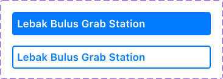
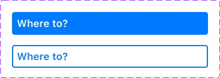
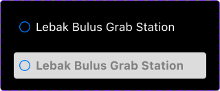
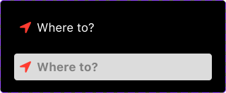

# Contents

1. [Component Oriented Design](#component-oriented-design)
2. [LoFi, HiFi, Prototype in Figma](https://www.figma.com/file/YYsNa16jRdHbOHHMoPREeP/MRT-Jakarta-Navigation?type=design&node-id=0%3A1&mode=design&t=mVYUCc8HBF6CJfJz-1)
3. [Protocol Orineted Programming](#protocol-oriented-programming)
4. [Use Case Oriented Programming](#use-case-oriented-programming)
5. [Clean Architecture](#clean-architecture-programming)
6. [Shenanigans](#shenanigans)
7. [To Do](#to-do)

# Component Oriented Design

For example, a project have 4 user stories.

**User Stories**
* User gets vibration and/or sound notification when arrive at their destination.
* User gets vibration and/or sound notification when the user near any station when in initial mode (Have not started navigation) and app in background mode.
* User gets vibration and/or sound notification when a train arrive in the departure station when in commuting mode (Have started navigation).
* User gets vibration and/or sound notification when the user arrive in a transit station when in commuting mode.

**Workflow**

1. Project Manager do vertical development by slicing the 1st user story into 3 use cases.

    * User Story:
        * User gets vibration and/or sound notification when arrive at their destination.

    * Use Cases:
        * User able to start navigation by selecting departure station and destination (High priority).
        * Notify user when arrived in destination when app in background mode (High priority).
        * Notify user when arrived in destination when app in foreground mode (High priority).

2. UI/UX Designer creates the LoFi by defining `what user can do` and `what user can see` in a Page.

    **LoFi Principles:**
    * Only use the Shape and the Text tools in Figma.
    * Use button hierarchy (primary, secondary, tertiary).
    * No local variables, no local styles, no components.

    What user can see:
    * Departure station and destination.

    What user can do:
    * Change the departure station and destination by clicking the buttton.

3. UI/UX Designer creates the design style guide.

    **Design style guide principles:**
    * Shape and text tools always use the tokenized colors.  

        Do not use the primitive colors directly.

        **Primitives Color**

        * red
            * red/0 = #FF000000
            * red/10 = #8B0000
            * red/20 = #800000

        * blue
            * blue/0 = #0000FF
            * blue/10 = #0000CD
            * blue/20 = #00008B

        * green
            * green/0 = #008000
            * green/10 = #006400
            * green/20 = #ADFF2F

        * white
            * white/0 = #FFFFFF
            * black/0 = #000000

    * Tokenized colors uses the primitive colors. 

        Do not use the Color hex directly. 

        Tokenized colors have Light and Dark Mode.

        **Tokenized Color**

        * clickableButtonBackground
            * Any = blue/0
            * Dark = blue/0

        * clickableButtonText
            * Any = white/0
            * Dark = white/0

        * focusedButtonText
            * Any = blue/0
            * Dark = blue/0

        * focusedButtonStroke
            * Any = black/0
            * Dark = black/0

    * It is advisable to use [Apple's Typography](https://developer.apple.com/design/human-interface-guidelines/typography) and [Apple's Color](https://developer.apple.com/design/human-interface-guidelines/color).

    **Why use tokenized color?**

    * Imagine you prefer to use `Hex color` directly.

        Imagine you have 3 identical shapes used in 3 Screens that use Hex color directly. 

        Now, imagine you want to change the shape's color. 

        You will have to change each Shape in each Screen, 3 times.

        Important: If you use Component in Figma, you only need to change the shape's color 1 time.

    * Imagine you prefer to use `Primitive color to Hex color` directly.

        Imagine you have primary button and the screen support Light Mode and Dark Mode.
        
        Consequently, you have 2 components for primary button: i.e.
        * Primary button background which use White color in Light Mode.
        * Primary button background which use Black color in Dark Mode.

        Now, imagine you want to change the primary button's background color. You will have to change the primary button's background color in each component, 2 times.

        Now, imagine if you use Tokenized color, `primary_button_background`. You only need to change the Tokenized color. Also, you only have 1 primary button component.

    * Imagine you prefer to use `Tokenized color to Hex color` directly and not to Primitive color.

        Imagine you have a 3 tokenized colors with Hex color #000000. #000000 is black in terms of primitive color.

        Now, imagine you want to change every #000000 to slightly brighter black Hex color #000011. 

        You will have to change each tokenized color, 3 times.

4. Software Engineer register the tokenized colors

    * clickableButtonBackground
        * Any = #0000FF
        * Dark = #0000FF

    * clickableButtonText
        * Any = #FFFFFF
        * Dark = #FFFFFF

    * focusedButtonText
        * Any = #0000FF
        * Dark = #0000FF

    * focusedButtonStroke
        * Any = #000000
        * Dark = #000000

5. UI/UX Designer creates the HiFi component for the departure and arrival button using components.

    Departure's component

    

    Arrival's component

    

6. Software Engineer creates the component's code.

    **Component's coding style guide:**

    * Use `@Binding` / `@ObservedObject`

        DepartureArrivalView.swift
        ```swift
        struct DepartureArrivalView: View {
            @ObservedObject private var viewModel: DepartureArrivalViewModel
            
            init(viewModel: DepartureArrivalViewModel = DepartureArrivalViewModel()) {
                self.viewModel = viewModel
            }
            
            var body: some View {
                Group {
                    DepartureOrArrivalButtonView(value: $viewModel.departure, selected: $viewModel.departureSelected)
                    DepartureOrArrivalButtonView(value: $viewModel.arrival, selected: $viewModel.arrivalSelected)
                }
            }
        }
        ```

        DepartureArrivalView+DepartureArrivalButtonView.swift
        ```swift
        extension DepartureArrivalView {
            struct DepartureOrArrivalButtonView: View {
                @Binding var value: Station
                @Binding var selected: Bool
                
                var body: some View {
                    Button {
                        selected = true
                    } label: {
                        Text("\(value.name) Station")
                            .frame(maxWidth: .infinity, alignment: .leading)
                            .font(.title2)
                    }
                    .selectedButtonStyle(selected)
                    .padding(16)
                }
            }
        }
        ```

    * The purpose of a preview is to show how to use the component in a screen.

        The example to show how to use the component
        ```swift
        private struct DepartureArrivalViewExample: View {
            @StateObject private var viewModel: DepartureArrivalViewModel
            
            init(viewModel: DepartureArrivalViewModel = DepartureArrivalViewModel()) {
                self._viewModel = StateObject(wrappedValue: viewModel)
            }
            
            var body: some View {
                VStack(spacing: 0) {
                    DepartureArrivalView(viewModel: viewModel)
                    
                    VStack(alignment: .leading, spacing: 0) {
                        Button("\(MRT.LebakBulusGrab.station.name) Station") {
                            viewModel.updateDepartureArrival(value: MRT.LebakBulusGrab.station)
                        }
                        .font(.title2)
                        .buttonStyle(.borderedProminent)
                        .padding(.vertical, 16)
                        
                        Button("\(MRT.FatmawatiIndomaret.station.name) Station") {
                            viewModel.updateDepartureArrival(value: MRT.FatmawatiIndomaret.station)
                        }
                        .font(.title2)
                        .buttonStyle(.borderedProminent)
                        .padding(.vertical, 16)
                        
                        Button("\(MRT.CipeteRaya.station.name) Station") {
                            viewModel.updateDepartureArrival(value: MRT.CipeteRaya.station)
                        }
                        .font(.title2)
                        .buttonStyle(.borderedProminent)
                        .padding(.vertical, 16)
                    }
                    
                    Spacer()
                }
            }
        }
        ```
        
        The preview
        ```swift
        struct DepartureArrivalViewExample_Previews: PreviewProvider {
            static var previews: some View {
                DepartureArrivalViewExample()
                    .environment(\.locale, .init(identifier: "id-ID"))
            }
        }
        ```

    * Use ViewModel if you have more than 1 variable to observe.

        Important: 1 ViewModel per responsibility i.e. a View used 2 ViewModels:

        * a ViewModel to handle the departure, arrival variables.
        * a ViewModel to handle the nearest schedule at departure and estimated time arrival at destination variables.
    
    * In a ViewModel, use guard clause to handle unique use case. 
    
        Important: Add the explanation on top of that guard clause pattern.

        Use case:
        ```
        arrival value: Lebak Bulus Grab Station
        use case: user want to go from Lebak Bulus Grab Station
        ```

        DepartureArrivalViewModel.swift
        ```swift
        final class DepartureArrivalViewModel: ObservableObject {
            @Published var departure: Station
            @Published var arrival: Station
            
            @Published var departureSelected: Bool
            var arrivalSelected: Bool {
                get {
                    return !departureSelected
                }
                set {
                    departureSelected = !newValue
                }
            }
            
            init(departure: Station = MRT.LebakBulusGrab.station, arrival: Station = MRT.DukuhAtasBNI.station, departureSelected: Bool = false) {
                self.departure = departure
                self.arrival = arrival
                self.departureSelected = departureSelected
            }
            
            func updateDepartureArrival(value: Station) {
                switch departureSelected {
                case true:
                    // arrival value: Lebak Bulus Grab Station
                    // use case: user want to go from Lebak Bulus Grab Station
                    if arrival == value {
                        departure = value
                        arrival = nil
                        return
                    }
                    
                    departure = value
                case false:
                    // departure value: Lebak Bulus Grab Station
                    // use case: user want to go from Dukuh Atas BNI Station to Lebak Bulus Grab
                    if departure == value {
                        departure = nil
                        arrival = value
                        return
                    }
                    
                    arrival = value
                }
            }
        }
        ```

8. UI/UX Designer creates component's iteration.

    Departure Iteration 1

    

    Departure Iteration 2

    

    Arrival Iteration 1

    

    Arrival Iteration 2

    

9. Software Engineer creates component's iteration.

    **Component's iteration principles:**
    * If 1st iteration and 2nd iteration have different behavior. i.e.
        * 1st iteration auto swap between departure and arrival station.
        * 2nd iteration do not auto swap between departure and arrival station.
    
        Then, use protocol oriented programming.

        DepartureArrivalViewModel.swift
        ```swift
        protocol DepartureArrivalViewModel: ObservableObject {
            var departure: Station? { get set }
            var arrival: Station? { get set }
            var departureSelected: Bool { get set }
            var arrivalSelected: Bool { get set }
            
            func updateDepartureArrival(value: Station) -> Bool
            func isDepartureArrivalNotNil() -> Bool
        }
        ```

        DepartureArrivalViewModelImpl.swift
        ```swift
        class DepartureArrivalViewModelImpl: DepartureArrivalViewModel {
            @Published var departure: Station?
            @Published var arrival: Station?
            
            @Published var departureSelected: Bool
            var arrivalSelected: Bool {
                get {
                    return !departureSelected
                }
                set {
                    departureSelected = !newValue
                }
            }
            
            init(departure: Station? = MRT.LebakBulusGrab.station, arrival: Station? = nil, departureSelected: Bool = false) {
                self.departure = departure
                self.arrival = arrival
                self.departureSelected = departureSelected
            }
            
            func updateDepartureArrival(value: Station) -> Bool {
                switch departureSelected {
                case true:
                    // arrival value: Lebak Bulus Grab Station
                    // use case: user want to go from Lebak Bulus Grab Station
                    if arrival == value {
                        departure = value
                        arrival = nil
                        return true
                    }
                    
                    departure = value
                case false:
                    // departure value: Lebak Bulus Grab Station
                    // use case: user want to go from Dukuh Atas BNI Station to Lebak Bulus Grab
                    if departure == value {
                        departure = nil
                        arrival = value
                        return true
                    }
                    
                    arrival = value
                }
                
                return true
            }
            
            func isDepartureArrivalNotNil() -> Bool {
                if departure == nil { return false }
                if arrival == nil { return false }
                
                return true
            }
        }
        ```

        DepartureArrivalV1ViewModel.swift
        ```swift
        final class DepartureArrivalV1ViewModel: DepartureArrivalViewModelImpl {}
        ```

        DepartureArrivalV1View.swift
        ```swift
        struct DepartureArrivalV1View<ViewModel>: View where ViewModel: DepartureArrivalViewModel {
            @ObservedObject private var viewModel: ViewModel
            
            init(viewModel: ViewModel = DepartureArrivalV1ViewModel()) {
                self.viewModel = viewModel
            }
            
            var body: some View {
                Grid(horizontalSpacing: 0, verticalSpacing: 0) {
                    GridRow {
                        Circle()
                            .stroke(.blue, lineWidth: 4)
                            .frame(width: 16, height: 16)
                            .padding(.trailing, 16)
                        
                        DepartureOrArrivalButtonView(value: $viewModel.departure, selected: $viewModel.departureSelected)
                    }
                    
                    GridRow {
                        Line()
                            .stroke(style: StrokeStyle(lineWidth: 2, dash: [8,8]))
                            .foregroundColor(Color("departureArrival_line"))
                            .frame(width: 1, height: 24)
                            .padding(.trailing, 16)
                        
                        
                    }
                    
                    GridRow {
                        Circle()
                            .stroke(.blue, lineWidth: 4)
                            .frame(width: 16, height: 16)
                            .padding(.trailing, 16)
                        
                        DepartureOrArrivalButtonView(value: $viewModel.arrival, selected: $viewModel.arrivalSelected)
                    }
                }
            }
        }
        ```

        DepartureArrivalV2ViewModel.swift
        ```swift
        final class DepartureArrivalV2ViewModel: DepartureArrivalViewModelImpl {
            override func updateDepartureArrival(value: Station) -> Bool {
                switch departureSelected {
                case true:
                    departure = value
                case false:
                    arrival = value
                }
                
                return true
            }
        }
        ```

        DepartureArrivalV2View.swift
        ```swift
        struct DepartureArrivalV2View<ViewModel>: View where ViewModel: DepartureArrivalViewModel {
            @ObservedObject private var viewModel: ViewModel
            
            init(viewModel: ViewModel = DepartureArrivalV2ViewModel()) {
                self._viewModel = ObservedObject(wrappedValue: viewModel)
            }
            
            var body: some View {
                VStack(spacing: 0) {
                    HStack(spacing: 0) {
                        DepartureV2View(value: $viewModel.departure, selected: $viewModel.departureSelected)
                        Spacer()
                            .frame(width: 24, height: 24)
                            .padding(.leading, 16)
                    }
                    HStack(spacing: 0) {
                        ArrivalV2View(value: $viewModel.arrival, selected: $viewModel.arrivalSelected)
                        PlusCircleView()
                            .padding(.leading, 16)
                    }
                }
            }
        }
        ```

# Protocol Oriented Programming

Software Engineer creates protocol for every use cases of the 1st user story.

* NotifyWhenNearMRTStationAndSpecificMRTStationOnce, requires:
    * NotifyWhenNearMRTStationWithGPS
    * NotifyWhenNearMRTstationWithBluetooth
    * AlarmManager (able to vibrate and/or play audio in background and foreground mode)

* NotifyWhenNearMRTStationOnce, requires:
    * NotifyWhenNearMRTStationWithGPS
    * NotifyWhenNearMRTStationWithBluetooth

* NotifyWhenNearMRTStationWhenInBackground, requires:
    * NotifyWhenNearMRTStationWithGPS
    * NotifyWhenNearMRTStationWithBluetooth
    * NotificationManager

* NotifyWhenNearMRTStationWithGPS, requires:
    * LocationFinder

* NotifyWhenMRTStationWithBluetooth, requires:
    * BeaconFinder

* BeaconBroadcaster (to simulate)


**Use Case protocol's coding style guide:**
* use delegate pattern if you wish to return a result asynchronously.

    NotifyWhenNearMRTStationWithGPS.swift
    ```swift
    protocol NotifyWhenNearMRTStationWithGPS {
        var delegate: NotifyWhenNearMRTStationWithGPSDelegate? { get set }
        
        func start() -> NotifyWhenNearMRTStationWithGPSStartEvent
        func stop() -> NotifyWhenNearMRTStationWithGPSStopEvent
    }

    protocol NotifyWhenNearMRTStationWithGPSDelegate {
        /// will notify once per station.
        func notifyManager(_ manager: NotifyWhenNearMRTStationWithGPS, didFind: Station)
    }

    protocol NotifyWhenNearMRTStationWithGPSEvent {}

    enum NotifyWhenNearMRTStationWithGPSStartEvent: NotifyWhenNearMRTStationWithGPSEvent { case IS_STARTING, NOT_AUTHORIZED }

    enum NotifyWhenNearMRTStationWithGPSStopEvent: NotifyWhenNearMRTStationWithGPSEvent { case IS_STOPPING }
    ```

* a function should return an actionable result i.e. `Bool` or `enum`.

* If function can't return a result, use completion pattern i.e. `func start(completionHandler: @escaping (Bool) -> Void)`

    Notification.swift
    ```swift
    protocol Notification {
        /// please show alert in view if return false
        func isAuthorizedOrRequestAuthorization(completionHandler: @escaping (Bool) -> Void)
        
        func push(title: String, subtitle: String, sound: UNNotificationSound?, completionHandler: @escaping (Bool) -> Void)
        func reset() -> NotificationResetEvent
    }

    protocol NotificationEvent {}

    enum NotificationPushEvent: NotificationEvent { case IS_PUSHING, NOT_AUTHORIZED }

    enum NotificationResetEvent: NotificationEvent { case IS_RESETTING }
    ```

* a function should have documentation comments if the behavior is peculiar i.e. `the finder stop after finding any station once`. 

    NotifyWhenNearMRTStationWithBluetooth.swift
    ```swift
    protocol NotifyWhenNearMRTStationWithBluetooth {
        var delegate: NotifyWhenNearMRTStationWithBluetoothDelegate? { get set }
        
        func start() -> NotifyWhenNearMRTStationWithBluetoothStartEvent
        func stop() -> NotifyWhenNearMRTStationWithBluetoothStopEvent
    }

    protocol NotifyWhenNearMRTStationWithBluetoothDelegate {
        // will update once per station
        func notifyManager(_ manager: NotifyWhenNearMRTStationWithBluetooth, didFind: Station)
    }

    protocol NotifyWhenNearMRTStationWithBluetoothEvent {}

    enum NotifyWhenNearMRTStationWithBluetoothStartEvent: NotifyWhenNearMRTStationWithBluetoothEvent { case IS_STARTING, NOT_AUTHORIZED }

    enum NotifyWhenNearMRTStationWithBluetoothStopEvent: NotifyWhenNearMRTStationWhenInBackgroundEvent { case IS_STOPPING }
    ```

* a function should use delegate pattern if the behavior is peculiar to return actionable result i.e. `.FINDER_GRACEFULLY_STOP` event.

    NotifyWhenNearMRTStationAndSpecificMRTStationOnce.swift
    ```swift
    protocol NotifyWhenNearMRTStationAndSpecificMRTStationOnce {
        var delegate: NotifyWhenNearMRTStationAndSpecificMRTStationOnceDelegate? { get set }
        
        /// will stop when found specific MRT station
        func start(arrival: Station) -> NotifyWhenNearMRTStationAndSpecificMRTStationOnceStartEvent
        /// for abrupt stop.
        func stop() -> NotifyWhenNearMRTStationAndSpecificMRTStationOnceStopEvent
    }

    enum NotifyWhenNearMRTStationAndSpecificMRTStationOnceDelegateEvent { case FOUND, ARRIVED }

    protocol NotifyWhenNearMRTStationAndSpecificMRTStationOnceDelegate {
        func notifyManager(_ manager: NotifyWhenNearMRTStationAndSpecificMRTStationOnce, didFind station: Station, didEvent event: NotifyWhenNearMRTStationAndSpecificMRTStationOnceDelegateEvent)
    }

    protocol NotifyWhenNearMRTStationAndSpecificMRTStationOnceEvent {}

    enum NotifyWhenNearMRTStationAndSpecificMRTStationOnceStartEvent: NotifyWhenNearMRTStationAndSpecificMRTStationOnceEvent { case IS_STARTING, NOT_AUTHORIZED }

    enum NotifyWhenNearMRTStationAndSpecificMRTStationOnceStopEvent: NotifyWhenNearMRTStationAndSpecificMRTStationOnceEvent { case IS_STOPPING }
    ```

# Use Case Oriented Programming

Use Case Oriented Programming enables you to focus on 1 specific business logic, i.e:
* `NotifyWhenNearMRTStationWithGPS.swift`
* `NotifyWhenNearMRTStationWithBluetooth.swift`

Then, you can write a business logic to do:
* if Bluetooth is not available, use GPS. `NotifyWhenNearMRTStationAndSpecificMRTStationOnce.swift`

**Protocol implementation's coding style guide:**
* `init` function should have default value.
* if `init` use static variable as default value, the implementation should have `deinit` closure.
* the static variable should live in a final class Manager. 

    By doing so, when you want to change the implementation logic, you can replace the shared variable's value.

    NotificationManager.swift
    ```swift
    final class NotificationManager {
        static var shared: Notification! {
            get {
                if sharedClosure == nil {
                    sharedClosure = NotificationImpl.shared
                }
                
                return sharedClosure
            }
            set {
                if newValue == nil {
                    NotificationImpl.shared = nil
                }
                
                sharedClosure = newValue
            }
        }
        
        private static var sharedClosure: Notification!
    }
    ```

    since Notification should not have more than 2 instance, you should private the constructor.

    NotificationImpl.swift
    ```swift
    final class NotificationImpl: Notification {
        fileprivate init() {}
        
        func isAuthorizedOrRequestAuthorization(completionHandler: @escaping (Bool) -> Void) {}
        
        func push(title: String, subtitle: String, sound: UNNotificationSound? = nil, completionHandler: @escaping (Bool) -> Void) {
        }
        
        func reset() -> NotificationResetEvent {
            return .IS_RESETTING
        }
    }

    extension NotificationImpl {
        static var shared: Notification! {
            get {
                if sharedClosure == nil {
                    sharedClosure = NotificationImpl()
                }
                
                return sharedClosure
            }
            set {
                sharedClosure = newValue
            }
        }
        
        private static var sharedClosure: Notification!
    }
    ```

    NotifyWhenNearMRTStationAndSpecificMRTStationOnceImpl.swift
    ```swift
    final class NotifyWhenNearMRTStationAndSpecificMRTStationOnceImpl: NotifyWhenNearMRTStationAndSpecificMRTStationOnce {
        var delegate: NotifyWhenNearMRTStationAndSpecificMRTStationOnceDelegate?
        
        private var notifyWhenNearMRTStationWithBluetooth: NotifyWhenNearMRTStationWithBluetooth
        private var notifyWhenNearMRTStationWithGPS: NotifyWhenNearMRTStationWithGPS
        
        private var currentStation: Station?
        
        private var arrival: Station?
        
        init(
            notifyWhenNearMRTStationWithBluetooth: NotifyWhenNearMRTStationWithBluetooth = NotifyWhenNearMRTStationWithBluetoothImpl(),
            notifyWhenNearMRTStationWithGPS: NotifyWhenNearMRTStationWithGPS = NotifyWhenNearMRTStationWithGPSImpl()
        ) {
            self.notifyWhenNearMRTStationWithBluetooth = notifyWhenNearMRTStationWithBluetooth
            self.notifyWhenNearMRTStationWithGPS = notifyWhenNearMRTStationWithGPS
            
            self.notifyWhenNearMRTStationWithBluetooth.delegate = self
            self.notifyWhenNearMRTStationWithGPS.delegate = self
        }
        
        func start(arrival: Station) -> NotifyWhenNearMRTStationAndSpecificMRTStationOnceStartEvent {
            self.arrival = arrival
            return .IS_STARTING
        }
        
        func stop() -> NotifyWhenNearMRTStationAndSpecificMRTStationOnceStopEvent {
            return .IS_STOPPING
        }
    }

    extension NotifyWhenNearMRTStationAndSpecificMRTStationOnceImpl: NotifyWhenNearMRTStationWithBluetoothDelegate {
        func notifyManager(_ manager: NotifyWhenNearMRTStationWithBluetooth, didFind station: Station) {
            if currentStation == station { return }
            
            currentStation = station
            
            if arrival == station { _ = stop() }
            
            delegate?.notifyManager(self, didFind: station, didEvent: arrival == station ? .ARRIVED : .FOUND)
        }
    }

    extension NotifyWhenNearMRTStationAndSpecificMRTStationOnceImpl: NotifyWhenNearMRTStationWithGPSDelegate {
        func notifyManager(_ manager: NotifyWhenNearMRTStationWithGPS, didFind station: Station) {
            if currentStation == station { return }
            
            currentStation = station
            
            if arrival == station { _ = stop() }
            
            delegate?.notifyManager(self, didFind: station, didEvent: arrival == station ? .ARRIVED : .FOUND)
        }
    }
    ```

# Clean Architecture Programming

1. Code is split into 3 layers: the Presentation layer, the Domain layer and the Data layer.

2. The Presentation layer splitted into 3 layers: the Components layer, the ViewModel layer and the Pages layer.

    The Components layer is used by the Pages layer.

    The ViewModel layer is used by the Pages layer. The purpose is to provide data to the Pages layer.

    The Pages layer should be as simple as it can.

    * The Pages layer

        DepartureArrivalPage.swift
        ```swift
        struct DepartureArrivalPage: View {
            @StateObject private var viewModel: DepartureArrivalV2ViewModel
            
            init(viewModel: DepartureArrivalV2ViewModel = DepartureArrivalV2ViewModel()) {
                self._viewModel = StateObject(wrappedValue: viewModel)
            }
            
            var body: some View {
                VStack(spacing: 0) {
                    DepartureArrivalV2View(viewModel: viewModel)
                    Spacer()
                }
                .padding(.horizontal, 32)
            }
        }
        ```

    * The ViewModels layer

        DepartureArrivalV2ViewModel.swift
        ```swift
        final class DepartureArrivalV2ViewModel: ObservableObject {
            @Published var departure: Station
            @Published var arrival: Station?
            
            @Published var departureSelected: Bool
            var arrivalSelected: Bool {
                get {
                    return !departureSelected
                }
                set {
                    departureSelected = !newValue
                }
            }
            
            init(departure: Station = MRT.LebakBulusGrab.station, arrival: Station? = nil, departureSelected: Bool = false) {
                self.departure = departure
                self.arrival = arrival
                self.departureSelected = departureSelected
            }
            
            func updateDepartureArrival(value: Station) {
                switch departureSelected {
                case true:
                    // swap
                    if arrival == value {
                        arrival = departure
                    }
                    
                    departure = value
                case false:
                    // swap
                    if departure == value {
                        if let arrival {
                            departure = arrival
                        }
                    }
                    
                    arrival = value
                }
            }
        }
        ```

    * The Components layer

        DepartureArrivalV2View.swift
        ```swift
        struct DepartureArrivalV2View: View {
            @ObservedObject private var viewModel: DepartureArrivalV2ViewModel
            
            init(viewModel: DepartureArrivalV2ViewModel = DepartureArrivalV2ViewModel()) {
                self._viewModel = ObservedObject(wrappedValue: viewModel)
            }
            
            var body: some View {
                VStack(spacing: 0) {
                    HStack(spacing: 0) {
                        DepartureV2View(value: $viewModel.departure, selected: $viewModel.departureSelected)
                        Spacer()
                            .frame(width: 24, height: 24)
                            .padding(.leading, 16)
                    }
                    HStack(spacing: 0) {
                        ArrivalV2View(value: $viewModel.arrival, selected: $viewModel.arrivalSelected)
                        PlusCircleView()
                            .padding(.leading, 16)
                    }
                }
            }
        }
        ```

        Important: use `+` to indicate the use of the extension keyword. In this case, a subcomponent of a component.

        Important: Do not complicate things with the `if else` logic, i.e.:
        * `DepartureArrivalV2View+DepartureV2View.swift`
        * `DepartureArrivalV2View+ArrivalV2View.swift` 
        
        Both views are similar, but diverge at some point.

        DepartureArrivalView+DepartureV2View.swift
        ```swift
        extension DepartureArrivalV2View {
            struct DepartureV2View: View {
                @Binding var value: Station
                @Binding var selected: Bool
                
                var body: some View {
                    Button {
                        selected = true
                    } label: {
                        HStack(spacing: 0) {
                            CircleView()
                            Text("\(value.name) Station")
                                .foregroundColor(selected ? Color("departureArrival_text_selectedv2") : Color("departureArrival_text_activev2"))
                                .font(.body)
                                .fontWeight(selected ? .bold : .regular)
                            Spacer()
                        }
                        .padding(8)
                        .background(selected ? Color("departureArrival_background_selectedv2") : nil)
                        .cornerRadius(4)
                    }
                }
            }
            
            struct CircleView: View {
                var body: some View {
                    Image(systemName: "circle")
                        .resizable()
                        .frame(width: 16, height: 16)
                        .foregroundColor(Color("icon_circle"))
                        .padding(.trailing, 8)
                }
            }
        }
        ```

        DepartureArrivalV2View+ArrivalV2View.swift
        ```swift
        extension DepartureArrivalV2View {
            struct ArrivalV2View: View {
                @Binding var value: Station?
                @Binding var selected: Bool
                
                var body: some View {
                    Button {
                        selected = true
                    } label: {
                        HStack(spacing: 0) {
                            LocationFillView()
                            Text((value != nil) ? "\(value?.name ?? "") Station" : "Where to?")
                                .foregroundColor(selected ? Color("departureArrival_text_selectedv2") : Color("departureArrival_text_activev2"))
                                .font(.body)
                                .fontWeight(selected ? .bold : .regular)
                            Spacer()
                        }
                        .padding(8)
                        .background(selected ? Color("departureArrival_background_selectedv2") : nil)
                        .cornerRadius(4)
                    }

                }
            }

            struct LocationFillView: View {
                var body: some View {
                    Image(systemName: "location.fill")
                        .resizable()
                        .frame(width: 16, height: 16)
                        .foregroundColor(Color("icon_location fill"))
                        .padding(.trailing, 8)
                }
            }
        }
        ```

3. The Domain layer splitted into 3 layers: the Entities layer, the Repositories layer the UseCases layer.

    The Entities layer is used by the Components and the ViewModel layer. i.e. `struct Station {}`

    The UseCases layer is used by the ViewModel layer.

    The Repositories layer is used by the UseCases layer and the DataSource layer. The purpose it to convert Data layer's model to Domain layer's entity.

4. The Data layer splitted into 2 layers: the Models layer and the DataSource layer.

    The Models layer is used by the Repositories layer and the DataSource layer. The purpose is to define what is expected result from the DataSource layer. i.e. a API response.

    The DataSource layer is used by the Repositories layer. The purpose it to get data from somewhere. i.e. from local storage or from an API.

    Important: the Repositories layer and the Data layer is optional if the data can be hard coded, then hard code it.

# Shenanigans

## Navigation shenanigans

1. Careful in hiding the navigation bar back button.

   When you hide navigation bar back button, it is STILL expected that you can pop view controller by swiping from the left to right, isn't it?

   It is achievable but it's hacky.

2. Do not immediately present a sheet after navigating to a new page.

   When you dismiss a sheet, it is expected to pop the view controller, isn't it?

   It is achievable but it's hacky.

   When you on a sheet, it is expected that you can pop view controller by swiping from the left to right, isn't it?

   No idea how to do that.

## SwiftUI shenanigans

1. Do not use `View.sheet(isPresented:onDismiss:content)` with:

    1. `View.presentationDetents(_ detents:)` / `View.presentationDetents(_ detents:selection)` with more than 1 detents.
    
    2. `View.presentationDragIndicator(_ visibility:)`

   When you close the sheet / leave the root view, the ViewModel will not deinit.

2. Do not use `View.navigationDestination(for:destination)`.

   When you navigate, the ViewModel will call init twice and call deinit once.
   
3. Careful in designing user experience.

   - It is normal to swipe from left to right to go back to the previous page, isn't it?
   
      The method ignore `UINavigationController.interactivePopGestureRecognizer.delegate = nil`. 
   
      Therefore, user unable to swipe to go back to the previous page.
   
      Important: only `View.navigationDestination(isPresented:destination)` that init and deinit ViewModel once.
   
   - It is normal to pop to root, isn't it?
   
      We can change the `isPresented` value of a parent view. However, the ViewModel will not deinit.
   
   Therefore, either use UIKit Navigation or sacrifice user experience.

## UIKit sheanigans

1. Do not use UIKit Navigation to present SwiftUI View as a sheet.

   When you change `@State` / `@Binding` / `@Published` value that affect the SwiftUI View that is presented as a sheet, the animation is from the left instead of dissolve.

# To Do

- [ ] Use UIKit Navigation
   - [ ] Create ViewControllable pattern
      - [ ] Navigate to another page.
      - [ ] Pop view controller when sheet is dismissed.
      - [ ] Dismiss sheet before navigating to another page.
   - [ ] Create Coordinator pattern
      - [ ] Coordinator used as delegate by a controller.
      - [ ] Coordinator update ViewModel's value.
